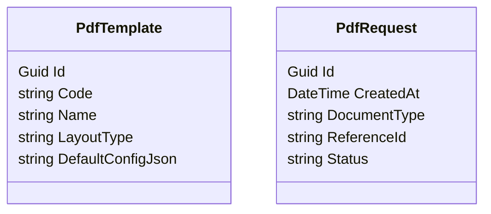

# PDF Generation Service Plan

## 1. Executive Summary
The `Maliev.PdfService` is a dedicated microservice responsible for generating high-quality, printable PDF documents for the Maliev ecosystem. It leverages **QuestPDF** for code-based, strongly-typed layout generation. The service supports multi-language output (English/Thai), configurable templates, and targets **.NET 10**.

## 2. Technical Stack

| Component | Technology | Description |
|-----------|------------|-------------|
| **Framework** | **.NET 10** | Cutting-edge framework version as requested. |
| **PDF Engine** | **QuestPDF** | High-performance, fluent API for PDF generation. |
| **Dev Tools** | **QuestPDF Companion** | Real-time hot-reload preview tool for template development. |
| **Database** | PostgreSQL | Stores template metadata, generation logs, and configurations. |
| **Messaging** | MassTransit (RabbitMQ) | Asynchronous PDF generation triggers. |
| **Storage** | **Google Cloud Storage** | Persistent PDF storage with Public Signed URLs. |
| **Orchestration** | Maliev.Aspire | Service discovery, configuration, and health checks. |

## 3. Architecture Design
The service follows the **Clean Architecture** pattern.

### 3.1. Layering
*   **Maliev.PdfService.Api**: REST Controllers, Middleware, DTOs, MassTransit Consumers.
*   **Maliev.PdfService.Application**: Business logic, PDF generation coordination, Template resolution.
*   **Maliev.PdfService.Domain**: Core entities, Domain Events.
*   **Maliev.PdfService.Infrastructure**: QuestPDF implementation, EF Core, Storage, External Clients.

### 3.2. Constraints & Patterns
*   **Routing**: All endpoints must strictly start with `/pdf` (e.g., `/pdf/generate`).
*   **Validation**: Use standard DataAnnotations or manual validation. **No FluentValidation**.
*   **Testing**: Use standard xUnit assertions. **No FluentAssertions**.

## 4. Key Features & Implementation Strategy

### 4.1. QuestPDF Integration
*   **Component-Based Design**: Reusable `IComponent` implementations (Header, Footer, Address, Table).
*   **QuestPDF Companion**:
    *   Configure `QuestPDF.Settings.EnableDebugging = true` in Development environment.
    *   Ensure the `QuestPDF.Previewer` (or Companion connection) is initialized in `Program.cs` for local dev.

### 4.2. Localization & Fonts
*   **Fonts**: Load **Kanit** (or TH Sarabun New) from embedded resources to ensure correct Thai rendering.
*   **Language**: Driven by request data (TargetLanguage code).

### 4.3. "Editable" Templates
*   **Visual Settings**: JSON configuration stored in DB (Logo, Colors, Fonts).
*   **Layout Variants**: Multiple `IDocument` implementations selectable via API.

## 5. Domain Model

## 6. Integration Points
*   **Triggers**: `POST /pdf/generate` or `InvoiceFinalizedEvent` (RabbitMQ).
*   **Aspire**: Register as a project resource in `Maliev.Aspire.AppHost`.

## 7. Roadmap
1.  **Phase 1: Foundation**: Scaffold .NET 10 service, setup QuestPDF with Companion support.
2.  **Phase 2: Templates**: Implement Invoice/Quotation with Thai support.
3.  **Phase 3**: MassTransit integration.